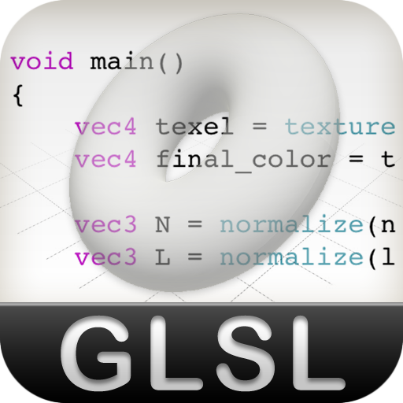
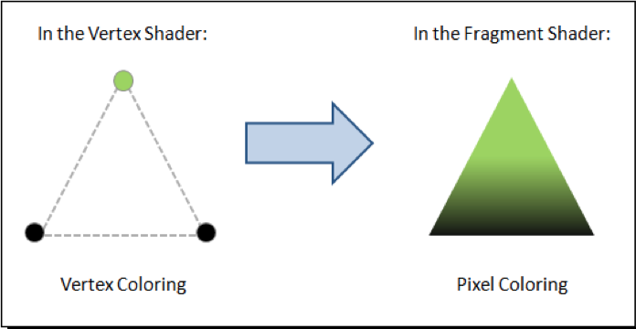
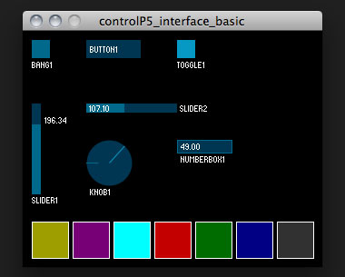
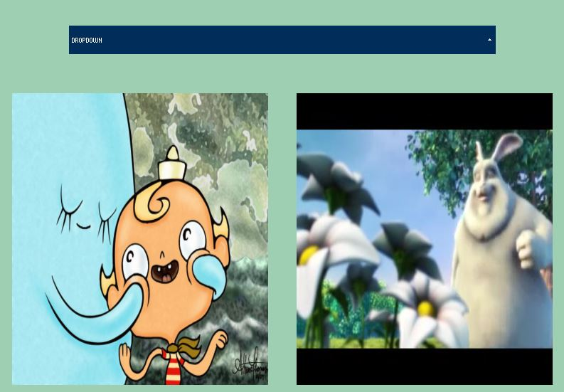
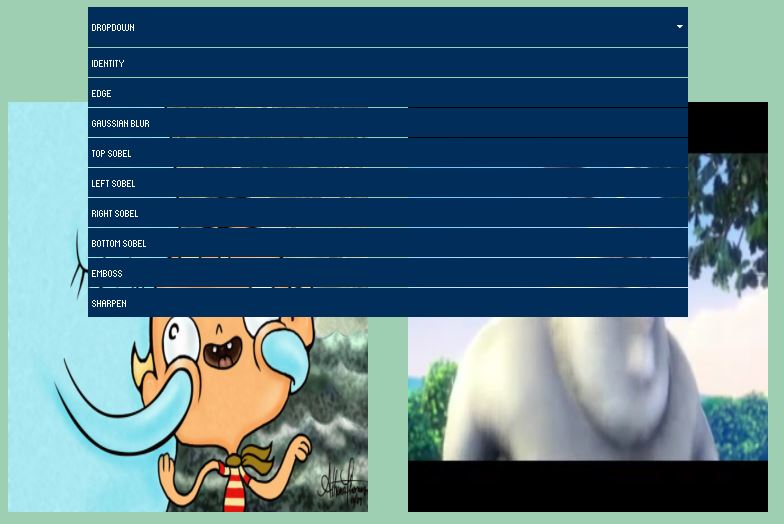
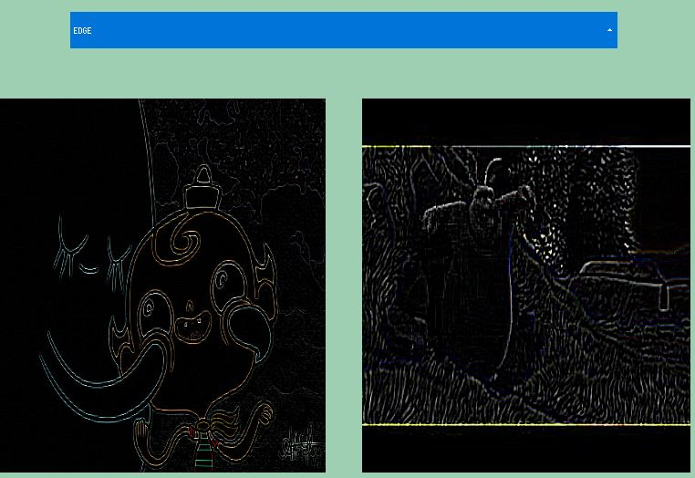
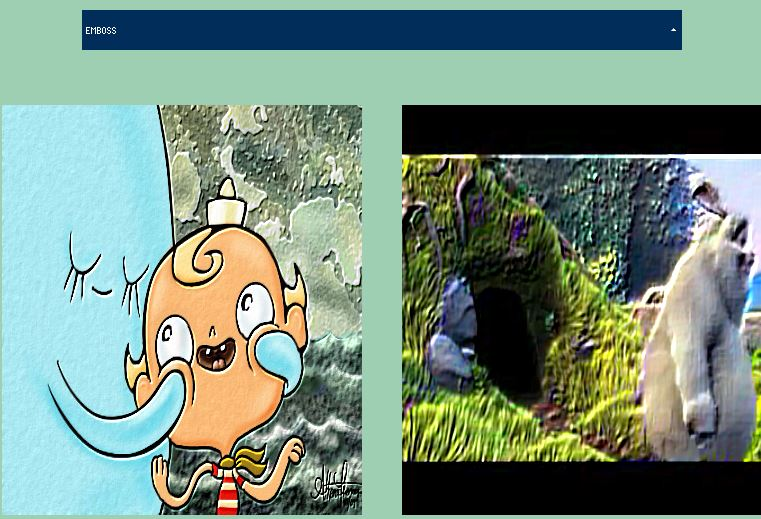

<section id="themes">
	<h2>Themes</h2>
		

			Set your presentation theme:  
			<!-- Hacks to swap themes after the page has loaded. Not flexible and only intended for the reveal.js demo deck. -->
                        <a href="#" onclick="document.getElementById('theme').setAttribute('href','css/theme/black.css'); return false;">Black (default)</a> -
			<a href="#" onclick="document.getElementById('theme').setAttribute('href','css/theme/white.css'); return false;">White</a> -
			<a href="#" onclick="document.getElementById('theme').setAttribute('href','css/theme/league.css'); return false;">League</a> -
			<a href="#" onclick="document.getElementById('theme').setAttribute('href','css/theme/sky.css'); return false;">Sky</a> -
			<a href="#" onclick="document.getElementById('theme').setAttribute('href','css/theme/beige.css'); return false;">Beige</a> -
			<a href="#" onclick="document.getElementById('theme').setAttribute('href','css/theme/simple.css'); return false;">Simple</a>  
			<a href="#" onclick="document.getElementById('theme').setAttribute('href','css/theme/serif.css'); return false;">Serif</a> -
			<a href="#" onclick="document.getElementById('theme').setAttribute('href','css/theme/blood.css'); return false;">Blood</a> -
			<a href="#" onclick="document.getElementById('theme').setAttribute('href','css/theme/night.css'); return false;">Night</a> -
			<a href="#" onclick="document.getElementById('theme').setAttribute('href','css/theme/moon.css'); return false;">Moon</a> -
			<a href="#" onclick="document.getElementById('theme').setAttribute('href','css/theme/solarized.css'); return false;">Solarized</a>
		

</section>

H:

# Convolution Matrix

Julian David Torregrosa - Juan Manuel Cuestas

H:

## Index

 1. Goal<!-- .element: class="fragment" data-fragment-index="1"-->
 2. Theory<!-- .element: class="fragment" data-fragment-index="2"-->
 3. Design<!-- .element: class="fragment" data-fragment-index="3"-->
 4. Interaction<!-- .element: class="fragment" data-fragment-index="5"-->
 5. Demo<!-- .element: class="fragment" data-fragment-index="5"-->
 6. Conclusions<!-- .element: class="fragment" data-fragment-index="6"-->
 7. Questions<!-- .element: class="fragment" data-fragment-index="7"-->

H:

## Goals

* Comprehend the way that filters works, by studying the convolution matrix theory.
* Design a Processing library to apply distinct filters to images and videos by using convolution matrixes.
* Use interaction controls with ControlP5.

H:
# Theory

V:
## Convolution
* Convolution is the treatment of a matrix by another one which is called “kernel”.
* The Convolution Matrix filter uses a first matrix which is the Image to be treated. The image is a bi-dimensional collection of pixels in rectangular coordinates. The used kernel depends on the effect you want.

V:
## Convolution
The filter studies successively every pixel of the image. For each of them, which we will call the “initial pixel”, it multiplies the value of this pixel and values of the 8 surrounding pixels by the kernel corresponding value. Then it adds the results, and the initial pixel is set to this final result value.

V:
## Convolution
* Sharpen: 	

			 `$\begin{bmatrix}
			  0 & 0 & 0 & 0 & 0 \cr
			  0 & 0 & -1 & 0 & 0 \cr
			  0 & -1 & 5 & -1 & 0 \cr
			  0 & 0 & -1 & 0 & 0 \cr
			  0 & 0 & 0 & 0 & 0 \cr
		 \end{bmatrix}
			 $`
	

V:
## Convolution
* Blur: 	

				 `$\begin{bmatrix}
				  0 & 0 & 0 & 0 & 0 \cr
				  0 & 1 & 1 & 1 & 0 \cr
				  0 & 1 & 1 & 1 & 0 \cr
				  0 & 1 & 1 & 1 & 0 \cr
				  0 & 0 & 0 & 0 & 0 \cr
			 \end{bmatrix}
				 $`

V:
## Convolution
* Edge enhance: 	

					 `$\begin{bmatrix}
					  0 & 0 & 0 \cr
					  -1 & 1 & 0 \cr
					  0 & 0 & 0 \cr
				 \end{bmatrix}
					 $`

V:
## Convolution
* Edge detect: 	

					 `$\begin{bmatrix}
					  0 & 1 & 0 \cr
					  1 & -4 & 1 \cr
					  0 & 1 & 0 \cr
				 \end{bmatrix}
					 $`

		
V:
## Convolution
* Emboss: 	

					 `$\begin{bmatrix}
					  -2 & -1 & 0 \cr
					  -1 & 1 & 1 \cr
					  0 & 1 & 2 \cr
				 \end{bmatrix}
					 $`

		

H:
# Design

V:
## PMatrix3D
Processing PMatrix3D is used to define the Kernel matrix.

* Sharpen

		 `$\begin{bmatrix}
			0 & -1 & 0 & 0 \cr
			-1 & 5 & -1 & 0 \cr
			0 & -1 & 0 & 0 \cr
			0 & 0 & 0 & 0 \cr
		\end{bmatrix}
		 $`

V:
* Gaussian blur

		 `$\begin{bmatrix}
			1 & 2 & 1 & 0 \cr
			2 & 4 & 2 & 0 \cr
			1 & 2 & 1 & 0 \cr
			0 & 0 & 0 & 0 \cr
		\end{bmatrix}
		 $`

V:
* Edge:

	`$\begin{bmatrix}
	-1 & -1 & -1 & 0 \cr
	-1 & 8 & -1 & 0 \cr
	-1 & -1 & -1 & 0 \cr
  0 & 0 & 0 & 0 \cr
	\end{bmatrix}
	$`

				

V:
* Emboss

				`$\begin{bmatrix}
				-2 & -1 & 0 & 0 \cr
				-1 & 1 & 1 & 0 \cr
				0 & 1 & 2 & 0 \cr
			  0 & 0 & 0 & 0 \cr
				\end{bmatrix}
				$`

		

V:

* Bottom Sobel			

		 				`$\begin{bmatrix}
		 				-1 & -2 & -1 & 0 \cr
		 				0 & 0 & 0 & 0 \cr
		 				1 & 2 & 1 & 0 \cr
		 			  0 & 0 & 0 & 0 \cr
		 				\end{bmatrix}
		 				$`

		

V:
* Left Sobel

		 		 				`$\begin{bmatrix}
		 		 				1 & 0 & -1 & 0 \cr
		 		 				2 & 0 & -2 & 0 \cr
		 		 				1 & 0 & -1 & 0 \cr
		 		 			  0 & 0 & 0 & 0 \cr
		 		 				\end{bmatrix}
		 		 				$`

		

V:
* Right Sobel

					 		 				`$\begin{bmatrix}
					 		 				-1 & 0 & 1 & 0 \cr
					 		 				-2 & 0 & 2 & 0 \cr
					 		 				-1 & 0 & 1 & 0 \cr
					 		 			  0 & 0 & 0 & 0 \cr
					 		 				\end{bmatrix}
					 		 				$`

V:
* Top Sobel

		 					 		 				`$\begin{bmatrix}
		 					 		 				1 & 2 & 1 & 0 \cr
		 					 		 				0 & 0 & 0 & 0 \cr
		 					 		 				-1 & -2 & -1 & 0 \cr
		 					 		 			  0 & 0 & 0 & 0 \cr
		 					 		 				\end{bmatrix}
		 					 		 				$`

V:
## GLSL
* Is the shader language included in OpenGL.
* GLSL simply stands for OpenGL Shading Language.
* Since Processing uses OpenGL as the basis for its P2D and P3D renderers, GLSL is the shader language that one has to use to write custom shaders to include in Processing sketches.

V:

## Shaders
 * A shader is basically a program that runs on the Graphics Processing Unit (GPU) of the computer, and generates the visual output we see on the screen given the information that defines a 2D or 3D scene
V:
## Fragment Shader

* Is the OpenGL pipeline stage after a primitive is rasterized. For each sample of the pixels covered by a primitive, a "fragment" is generated.

H:
# Interaction

V:
## ControlP5

* Library that provides controllers to build a graphical user interface on top of your processing sketch include Sliders, Buttons, Toggles, Knobs, Textfields, RadioButtons, Checkboxes amongst others and can be easily added to a processing sketch.

V:

* Implementing ControlP5, the user can select the type of effect to apply:

H:

# Demo
V:
## Demo

H:

## Conclusions

* Videos and images have a complex composition behind what we can see. The undertanding of it's computational representation give us a powerfull tool to work with this kind of media files.  
* The use of Shaders provide as well a useful tool to get easier this kind of works as the implementation of image filters.
* ControlP5 provides both to the programer and the user, a useful set of elements to facilitate the interaction with the Processing sketches.

H:

## Questions

?

H:

## References

* [Convolution Matrix & Generic Filters](https://docs.gimp.org/en/plug-in-convmatrix.html)
* [Image Kernels](http://setosa.io/ev/image-kernels/)
* [Kernel - Image processing](https://en.wikipedia.org/wiki/Kernel_(image_processing)
* [Saders - Processing](https://processing.org/tutorials/pshader/)
* [ControlP5](http://www.sojamo.de/libraries/controlP5/)
* [Fragment Shader](https://www.khronos.org/opengl/wiki/Fragment_Shader)
