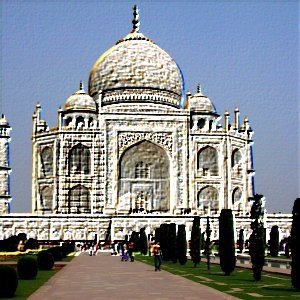

<section id="themes">
	<h2>Themes</h2>
		

			Set your presentation theme:  
			<!-- Hacks to swap themes after the page has loaded. Not flexible and only intended for the reveal.js demo deck. -->
                        <a href="#" onclick="document.getElementById('theme').setAttribute('href','css/theme/black.css'); return false;">Black (default)</a> -
			<a href="#" onclick="document.getElementById('theme').setAttribute('href','css/theme/white.css'); return false;">White</a> -
			<a href="#" onclick="document.getElementById('theme').setAttribute('href','css/theme/league.css'); return false;">League</a> -
			<a href="#" onclick="document.getElementById('theme').setAttribute('href','css/theme/sky.css'); return false;">Sky</a> -
			<a href="#" onclick="document.getElementById('theme').setAttribute('href','css/theme/beige.css'); return false;">Beige</a> -
			<a href="#" onclick="document.getElementById('theme').setAttribute('href','css/theme/simple.css'); return false;">Simple</a>  
			<a href="#" onclick="document.getElementById('theme').setAttribute('href','css/theme/serif.css'); return false;">Serif</a> -
			<a href="#" onclick="document.getElementById('theme').setAttribute('href','css/theme/blood.css'); return false;">Blood</a> -
			<a href="#" onclick="document.getElementById('theme').setAttribute('href','css/theme/night.css'); return false;">Night</a> -
			<a href="#" onclick="document.getElementById('theme').setAttribute('href','css/theme/moon.css'); return false;">Moon</a> -
			<a href="#" onclick="document.getElementById('theme').setAttribute('href','css/theme/solarized.css'); return false;">Solarized</a>
		

</section>

H:

# Convolution Matrix

Julian David Torregrosa - Juan Manuel Cuestas

H:

## Index

 1. Goal<!-- .element: class="fragment" data-fragment-index="1"-->
 2. Theory<!-- .element: class="fragment" data-fragment-index="2"-->
 3. Design<!-- .element: class="fragment" data-fragment-index="3"-->
 4. Interaction<!-- .element: class="fragment" data-fragment-index="5"-->
 5. Demo<!-- .element: class="fragment" data-fragment-index="5"-->
 6. Conclusions<!-- .element: class="fragment" data-fragment-index="6"-->
 7. Questions<!-- .element: class="fragment" data-fragment-index="7"-->

H:

## Goals

* Comprehend the way that filters works, by studying the convolution matrix theory.
* Design a Processing library to apply distinct filters to images and videos by using the convolution matrix.

H:
## Theory

V:
# Convolution
* Convolution is the treatment of a matrix by another one which is called “kernel”.
* The Convolution Matrix filter uses a first matrix which is the Image to be treated. The image is a bi-dimensional collection of pixels in rectangular coordinates. The used kernel depends on the effect you want.

V:
# Convolution
The filter studies successively every pixel of the image. For each of them, which we will call the “initial pixel”, it multiplies the value of this pixel and values of the 8 surrounding pixels by the kernel corresponding value. Then it adds the results, and the initial pixel is set to this final result value.

V:
# Convolution
* Sharpen: 	

			 `$\begin{bmatrix}
			  0 & 0 & 0 & 0 & 0 \cr
			  0 & 0 & -1 & 0 & 0 \cr
			  0 & -1 & 5 & -1 & 0 \cr
			  0 & 0 & -1 & 0 & 0 \cr
			  0 & 0 & 0 & 0 & 0 \cr
		 \end{bmatrix}
			 $`
	

V:
# Convolution
* Blur: 	

				 `$\begin{bmatrix}
				  0 & 0 & 0 & 0 & 0 \cr
				  0 & 1 & 1 & 1 & 0 \cr
				  0 & 1 & 1 & 1 & 0 \cr
				  0 & 1 & 1 & 1 & 0 \cr
				  0 & 0 & 0 & 0 & 0 \cr
			 \end{bmatrix}
				 $`

V:
# Convolution
* Edge enhance: 	

					 `$\begin{bmatrix}
					  0 & 0 & 0 \cr
					  -1 & 1 & 0 \cr
					  0 & 0 & 0 \cr
				 \end{bmatrix}
					 $`

V:
# Convolution
* Edge detect: 	

					 `$\begin{bmatrix}
					  0 & 1 & 0 \cr
					  1 & -4 & 1 \cr
					  0 & 1 & 0 \cr
				 \end{bmatrix}
					 $`

		
V:
# Convolution
* Emboss: 	

					 `$\begin{bmatrix}
					  -2 & -1 & 0 \cr
					  -1 & 1 & 1 \cr
					  0 & 1 & 2 \cr
				 \end{bmatrix}
					 $`

		

H:
## Design

*

V:

## Design
*

## Interaction

H:

## Demo

V:

## Demo
### Example

H:

## Conclusions

*

H:

## Questions

?

H:

## References

* [Convolution Matrix & Generic Filters](https://docs.gimp.org/en/plug-in-convmatrix.html)
* [Image Kernels](http://setosa.io/ev/image-kernels/)
* [Kernel - Image processing](https://en.wikipedia.org/wiki/Kernel_(image_processing)
